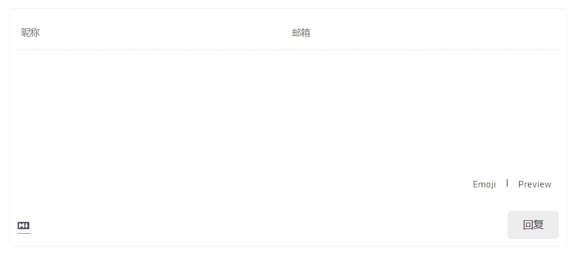
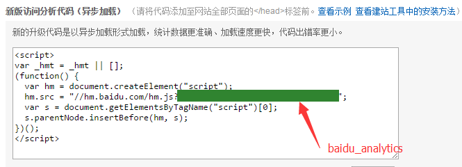
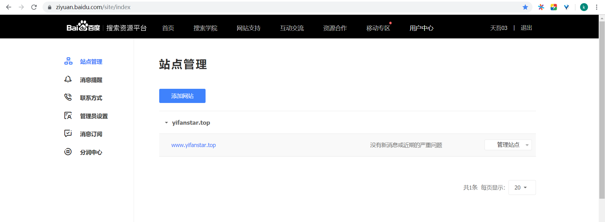
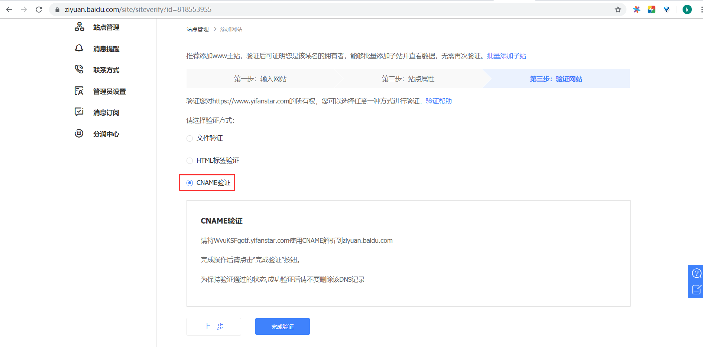
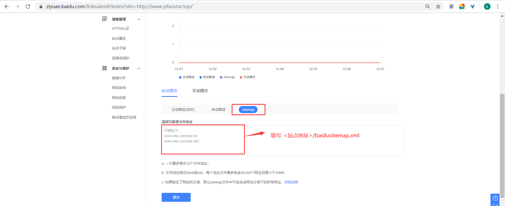
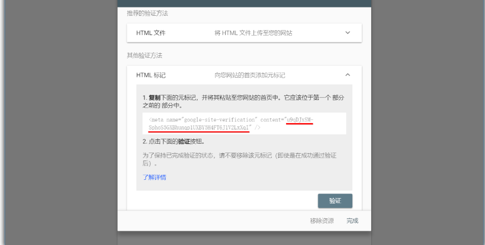
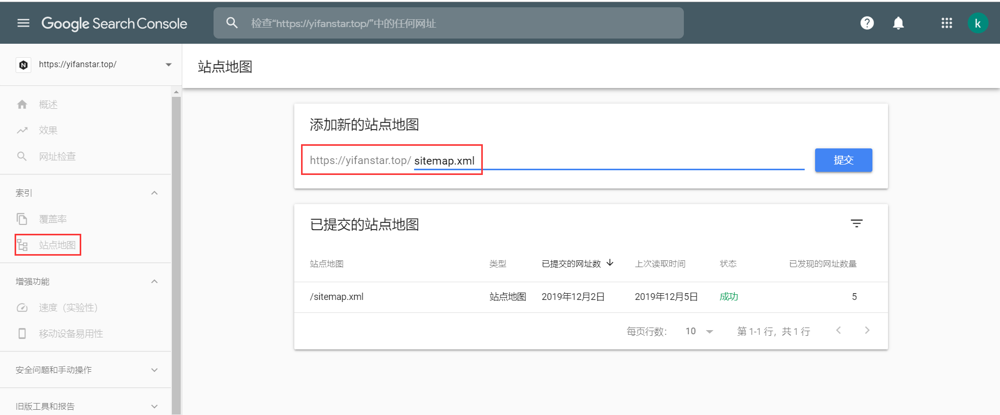

## Star's Tech Blog

框架驱动：[Hexo](https://hexo.io/zh-cn/)  

博客主题：[NexT ^6.x](https://github.com/theme-next/hexo-theme-next)

## 博客搭建与配置

### 环境准备

- [Node.js](http://nodejs.org/)

- [Git](http://git-scm.com/)

### Hexo 搭建

安装 Hexo，打开 Git Bash 命令窗口，输入命令：

```bash
npm install -g hexo-cli
```
安装好 Hexo 后，在任意目录新建一个空文件夹，名字可以为 blogs，然后进入这个文件夹，在命令行输入命令：

```bash
hexo init 
```
执行完成后（如果命令窗口出现橙色的 WARN 不用管），生成文件结构：

```bash
├── node_modules       //依赖安装目录
├── scaffolds          //模板文件夹，新建的文章将会从此目录下的文件中继承格式
|   ├── draft.md         //草稿模板
|   ├── page.md          //页面模板
|   └── post.md          //文章模板
├── source             //资源文件夹，用于放置图片、数据、文章等资源
|   └── _posts           //文章目录
├── themes             //主题文件夹
|   └── landscape        //默认主题
├── .gitignore         //指定不纳入git版本控制的文件
├── _config.yml        //站点配置文件
├── db.json            
├── package.json
└── package-lock.json
```
下载依赖包，输入命令：

```bash
npm install
```
依赖包下载完成后，输入如下命令启动 hexo 的内置 Web 服务器：

```bash
hexo g // 打包文件

hexo s // 启动服务器
```

然后可以在在浏览器中通过地址 http://localhost:4000/ 访问博客了。

### 更换 NexT 主题

Hexo 更换主题的方式很简单，只需要将主题文件拷贝至根目录下的 themes 目录中， 然后修改根目录下 `_config.yml` 文件中的 theme 字段，便可完成更换。

在博客项目的根目录下，输入命令：

```bash
git clone https://github.com/theme-next/hexo-theme-next.git themes/next
```
打开根目录下 `_config.yml` 文件,将 theme 字段的值修改为 next。

```yml
# Extensions
## Plugins: https://hexo.io/plugins/
## Themes: https://hexo.io/themes/
theme: next
```

这个时候需要重启服务器 `hexo g && hexo s` 并刷新才能使主题生效。

### 重要定义

在项目文件中存在两个 `_config.yml` 文件，为了方便区分。

- 项目根目录下的 `_config.yml` 文件叫作`站点配置文件`。

- 主题文件夹根目录下的 `themes/next/_config.yml` 文件叫作`主题配置文件`。

### 部署到 GitHub Pages

**GitHub 配置**

- 创建 [GitHub](https://github.com/) 账号

- 创建仓库，仓库名必须是：<GitHub 账号名称>.github.io，这是GitHub pages 的特殊命名规范

**修改站点配置文件 _config.yml**

```yml
# Deployment
## Docs: https://hexo.io/docs/deployment.html
deploy:
  type: 'git'
  repo: 
    github: https://github.com/yifanzheng/yifanzheng.github.io.git
  branch: master
```

**注意**：`GitHub pages` 仅在 `master` 分支下实现。

**部署**  

- 在项目根目录下，安装 Git 部署插件：

```bash
npm install hexo-deployer-git --save
```

- 部署到 Github Pages

```bash
hexo g 

hexo d
```

部署完成后，在浏览器访问网址：https://<Github账号名称>.github.io 即可查看博客。

详细过程可以参考：[借助 GitHub pages 搭建静态个人网站并绑定域名](https://blog.csdn.net/weixin_39510813/article/details/80216552)


### 站点配置

站点配置可以查看 Hexo 官方文档。

Hexo 官方文档：https://hexo.io/zh-cn/docs/configuration.html 。

**注意**：所有的 `:` 都为英文字符，后面必须有一个空格。

### 主题配置  

NexT 的主题配置可以先查看官方文档，写得很不错，很完善。

NexT 官方文档：http://theme-next.iissnan.com/getting-started 。

NexT （最新）官方文档：https://theme-next.org/docs/getting-started/ 。

### 第三方配置

**鼠标点击特效**

从各个站点里收集了以下四个比较常用的鼠标点击特效：

- 礼花特效

  

下载：[礼花特效](asset/js/firework.js)

- 爆炸特效

  

下载：[爆炸特效](asset/js/explosion.min.js)

- 浮出爱心

  

下载：[浮出爱心](asset/js/love.min.js)

- 浮出文字

  

下载：[浮出文字](asset/js/text.js)


将脚本文件放置于 `themes/next/source/js/cursor` 目录下（如果没有相应的目录，需要自行创建，可以根据自己习惯命名）。

在主题自定义布局文件 `themes/next/layout/_custom/custom.swig` （如果没有 custom.swig 文件，需自行创建）中添加如下代码：

```js
{# 鼠标点击特效 #}

  <script async src="/js/cursor/fireworks.js"></script>

  <canvas class="fireworks" style="position: fixed;left: 0;top: 0;z-index: 1; pointer-events: none;" ></canvas>
  <script src="//cdn.bootcss.com/animejs/2.2.0/anime.min.js"></script>
  <script async src="/js/cursor/explosion.min.js"></script>

  <script async src="/js/cursor/love.min.js"></script>

  <script async src="/js/cursor/text.js"></script>

```

在 `themes/next/layout/_layout.swig` 文件 body 标签中添加如下代码：

```js
    ...
    
  </body>
</html>
```

在主题配置文件 `themes/next/_config.yml` 中添加如下代码：

```yml
# mouse click effect: fireworks | explosion | love | text 
  cursor_effect: love
```

**打字特性**

- 打字礼花



下载：[打字礼花](asset/js/activate-power-mode.min.js)  

将脚本文件放置到 `themes/next/source/js` 目录下。

在主题自定义配置 `themes/next/layout/_custom/custom.swig` 文件中添加如下代码：

```js

  <script async src="/js/activate-power-mode.min.js"></script>
  <script>
    POWERMODE.colorful = {{ theme.typing_effect.colorful }};
    POWERMODE.shake = {{ theme.typing_effect.shake }};
    document.body.addEventListener('input', POWERMODE);
  </script>

```

在主题配置文件 `themes/next/_config.yml` 中添加如下代码：

```yml
# typing effect
typing_effect:
  colorful: true  # 礼花特效
  shake: false  # 震动特效
```

在 `themes/next/layout/_layout.swig` 文件 body 标签中添加如下代码：

```js
    ...
    
  </body>
</html>
```

**网站运行时间**

在主题自定义配置 `themes/next/layout/_custom/custom.swig` 文件中添加如下代码：

```js
{# 页脚站点运行时间统计 #}

  <script src="https://cdn.jsdelivr.net/npm/moment@2.22.2/moment.min.js"></script>
  <script src="https://cdn.jsdelivr.net/npm/moment-precise-range-plugin@1.3.0/moment-precise-range.min.js"></script>
  <script>
    function timer() {
      var ages = moment.preciseDiff(moment(),moment({{ theme.footer.site_runtime.since }},"YYYYMMDD"));
      ages = ages.replace(/years?/, "年");
      ages = ages.replace(/months?/, "月");
      ages = ages.replace(/days?/, "天");
      ages = ages.replace(/hours?/, "小时");
      ages = ages.replace(/minutes?/, "分");
      ages = ages.replace(/seconds?/, "秒");
      ages = ages.replace(/\d+/g, '<span style="color:{{ theme.footer.site_runtime.color }}">$&</span>');
      div.innerHTML = `{{ __('footer.site_runtime')}} ${ages}`;
    }
    var div = document.createElement("div");
    //插入到copyright之后
    var copyright = document.querySelector(".copyright");
    document.querySelector(".footer-inner").insertBefore(div, copyright.nextSibling);
    timer();
    setInterval("timer()",1000)
  </script>

```

在 `themes/next/layout/_layout.swig` 文件 body 标签中添加如下代码：

```js
    ...
    
  </body>
</html>
```

在主题主题配置文件 `themes/next/_config.yml` 中添加如下内容：

```diff
  footer:
    ...
+  # Web Site runtime 
+  site_runtime: 
+  enable: true 
+  # Specify the date when the site was setup
+  since: 20191124
+  # color of number
+  color: "#1890ff"
```

然后在文件 `themes\next\languages\zh-CN.yml` 中补全对应文案：

```diff
  footer:
    powered: "由 %s 强力驱动"
    theme: 主题
    # total_views: 总访问量
    # total_visitors: 总访客量
    total_views: "历经 %s 次回眸才与你相遇"
    total_visitors: "我的第 %s 位朋友"
+   site_runtime: "我已在此等候你"
```

**文章阅读量 - LeanCloud** 

LeanCloud 能够给每篇博客统计访问量的工具。首先注册并登录 LeanCloud。  

LeanCloud 官网：https://www.leancloud.cn/ 。

- LeanCloud 应用配置

参考：https://github.com/theme-next/hexo-theme-next/blob/master/docs/zh-CN/LEANCLOUD-COUNTER-SECURITY.md

- hexo-leancloud-counter-security 插件安装与配置

参考：https://github.com/theme-next/hexo-leancloud-counter-security


**评论系统 - Valine**

Valine 是一款基于 Leancloud 的快速，简单和高效的无后端评论系统。

Valine 官网：https://valine.js.org/ 。

配置参考：https://theme-next.org/docs/third-party-services/comments#Valine


### 百度统计

登录[百度统计](https://tongji.baidu.com/)， 定位到站点的代码获取页面。  
复制 hm.js? 后面那串统计脚本 id，如图：   



编辑`主题配置文件`，修改字段 `baidu_analytics`, 字段值设置成你的百度统计脚本 id。

```yml
# Baidu Analytics
baidu_analytics: # <app_id>
```

### 收录

**百度收录**

- 添加站点

在 [百度搜索资源平台](https://ziyuan.baidu.com/) 中提交站点域名，勾选站点属性，最后一步中同样会要求验证网站的所有权身份，选择 **CNAME 验证**，然后将给出的 ID 信息使用 CNAME 解析到 `ziyuan.baidu.com`。 





到 [阿里云](https://dns.console.aliyun.com/) 进行域名解析。


- 生成网站地图

使用 npm 自动生成网站的 sitemap，然后将生成的 sitemap 提交到百度搜索引擎，输入如下命令安装 sitemap 插件。

```bash
npm install hexo-generator-sitemap --save     
npm install hexo-generator-baidu-sitemap --save
```
在 `站点配置文件` 添加如下代码：

```yml
# hexo sitemap
sitemap:
  path: sitemap.xml

baidusitemap:
  path: baidusitemap.xml
```

配置成功后，会生成 `sitemap.xml` 和 `baidusitemap.xml`，`sitemap.xml` 一般提交给谷歌搜素引擎，`baidusitemap.xml` 一般适合提交百度搜索引擎。

提交百度 sitemap：

  

除了 sitemap 之外还提供了多种推送站点内容的方案：

1. 主动推送：通过 API 接口推送站点内容，实时性较高。
2. 自动推送：在网页内添加 JS 脚本，每当页面被访问的时候会将页面 url 推送给百度，比较被动。
3. sitemap：填写站点地图文件地址，百度会周期性的抓取其中的内容进行分析收录，收录效率比较低。
4. 手动提交：手动填写链接地址进行收录。

- 开启主动推送


Hexo 中可以利用 hexo-baidu-url-submit 插件实现主动推送，在项目根目录下输入以下命令安装依赖：

```bash
npm install hexo-baidu-url-submit --save
```

在 `站点配置文件` 中添加以下代码：

```yml
# baidu SEO
baidu_url_submit: 
  count: 80 # 提交最新的一个链接 
  host: www.yifanstar.top # 在百度站长平台中注册的域名 
  token: <your token> # 请注意这是您的秘钥， 所以请不要把博客源代码发布在公众仓库里! 
  path: baidu_urls.txt # 文本文档的地址， 新链接会保存在此文本文档里
```
在 `站点配置文件` 中修改部署策略：

```diff
# Deployment
## Docs: https://hexo.io/docs/deployment.html
deploy:
 -
  type: 'git'
  repo: 
    github: https://github.com/yifanzheng/yifanzheng.github.io.git
    coding: https://git.dev.tencent.com/yifanzheng/blogs.git
  branch: master
+ - 
+  type: baidu_url_submitter
```

- 开启自动推送

Next 主题中内置了开启百度自动推送的选项，只需将其设置成 true 即可：

```yml
# Enable baidu push so that the blog will push the url to baidu automatically which is very helpful for SEO
baidu_push: true
```

**谷歌收录**  

在 [Google Search Console]( https://search.google.com/search-console) 中提交站点域名，此时会提供几种验证网站所有权的方法，展开其他验证方法中的 **HTML 标记**，然后将 meta 标签的 content 属性值复制到主题配置文件中：



```yml
# Google Webmaster tools verification setting
# See: https://www.google.com/webmasters/
google_site_verification: <content>
```

回到 Search Console 页面点击验证按钮，验证成功后将进入控制台，点击左侧 **站点地图** 菜单，在域名后输入 `sitemap.xml` 并提交，完成站点地图的添加。



### 使用 Gulp 压缩静态资源

Gulp 是前端开发过程中对代码进行构建的工具，是自动化项目的构建利器。不仅能对网站的资源进行优化，并且能在开发过程中能够对很多重复的任务使其自动完成。

- 安装 Gulp

```bash
npm install gulp -g 
```
- 安装 Gulp 的插件

```bash
# 安装功能模块
npm install gulp-htmlclean gulp-htmlmin gulp-minify-css gulp-uglify gulp-imagemin --save

# 额外的功能模块
npm install gulp-debug gulp-clean-css gulp-changed gulp-if gulp-plumber gulp-babel babel-preset-es2015 del --save
```

接下来在博客项目的根目录下新建 `gulpfile.js` 文件，并复制下面的内容到文件中：

```js
var gulp = require("gulp");
var debug = require("gulp-debug");
var cleancss = require("gulp-clean-css"); //css压缩组件
var uglify = require("gulp-uglify"); //js压缩组件
var htmlmin = require("gulp-htmlmin"); //html压缩组件
var htmlclean = require("gulp-htmlclean"); //html清理组件
var imagemin = require("gulp-imagemin"); //图片压缩组件
var changed = require("gulp-changed"); //文件更改校验组件
var gulpif = require("gulp-if"); //任务 帮助调用组件
var plumber = require("gulp-plumber"); //容错组件（发生错误不跳出任务，并报出错误内容）
var isScriptAll = true; //是否处理所有文件，(true|处理所有文件)(false|只处理有更改的文件)
var isDebug = true; //是否调试显示 编译通过的文件
var gulpBabel = require("gulp-babel");
var es2015Preset = require("babel-preset-es2015");
var del = require("del");
var Hexo = require("hexo");
var hexo = new Hexo(process.cwd(), {}); // 初始化一个hexo对象

// 清除public文件夹
gulp.task("clean", function() {
  return del(["public/**/*"]);
});

// 下面几个跟hexo有关的操作，主要通过hexo.call()去执行，注意return
// 创建静态页面 （等同 hexo generate）
gulp.task("generate", function() {
  return hexo.init().then(function() {
    return hexo
      .call("generate", {
        watch: false
      })
      .then(function() {
        return hexo.exit();
      })
      .catch(function(err) {
        return hexo.exit(err);
      });
  });
});

// 启动Hexo服务器
gulp.task("server", function() {
  return hexo
    .init()
    .then(function() {
      return hexo.call("server", {});
    })
    .catch(function(err) {
      console.log(err);
    });
});

// 部署到服务器
gulp.task("deploy", function() {
  return hexo.init().then(function() {
    return hexo
      .call("deploy", {
        watch: false
      })
      .then(function() {
        return hexo.exit();
      })
      .catch(function(err) {
        return hexo.exit(err);
      });
  });
});

// 压缩public目录下的js文件
gulp.task("compressJs", function() {
  return gulp
    .src(["./public/**/*.js", "!./public/libs/**"]) //排除的js
    .pipe(gulpif(!isScriptAll, changed("./public")))
    .pipe(gulpif(isDebug, debug({ title: "Compress JS:" })))
    .pipe(plumber())
    .pipe(
      gulpBabel({
        presets: [es2015Preset] // es5检查机制
      })
    )
    .pipe(uglify()) //调用压缩组件方法uglify(),对合并的文件进行压缩
    .pipe(gulp.dest("./public")); //输出到目标目录
});

// 压缩public目录下的css文件
gulp.task("compressCss", function() {
  var option = {
    rebase: false,
    //advanced: true,               //类型：Boolean 默认：true [是否开启高级优化（合并选择器等）]
    compatibility: "ie7" //保留ie7及以下兼容写法 类型：String 默认：''or'*' [启用兼容模式； 'ie7'：IE7兼容模式，'ie8'：IE8兼容模式，'*'：IE9+兼容模式]
    //keepBreaks: true,             //类型：Boolean 默认：false [是否保留换行]
    //keepSpecialComments: '*'      //保留所有特殊前缀 当你用autoprefixer生成的浏览器前缀，如果不加这个参数，有可能将会删除你的部分前缀
  };
  return gulp
    .src(["./public/**/*.css", "!./public/**/*.min.css"]) //排除的css
    .pipe(gulpif(!isScriptAll, changed("./public")))
    .pipe(gulpif(isDebug, debug({ title: "Compress CSS:" })))
    .pipe(plumber())
    .pipe(cleancss(option))
    .pipe(gulp.dest("./public"));
});

// 压缩public目录下的html文件
gulp.task("compressHtml", function() {
  var cleanOptions = {
    protect: /<\!--%fooTemplate\b.*?%-->/g, //忽略处理
    unprotect: /<script [^>]*\btype="text\/x-handlebars-template"[\s\S]+?<\/script>/gi //特殊处理
  };
  var minOption = {
    collapseWhitespace: true, //压缩HTML
    collapseBooleanAttributes: true, //省略布尔属性的值  <input checked="true"/> ==> <input />
    removeEmptyAttributes: true, //删除所有空格作属性值    <input id="" /> ==> <input />
    removeScriptTypeAttributes: true, //删除<script>的type="text/javascript"
    removeStyleLinkTypeAttributes: true, //删除<style>和<link>的type="text/css"
    removeComments: true, //清除HTML注释
    minifyJS: true, //压缩页面JS
    minifyCSS: true, //压缩页面CSS
    minifyURLs: true //替换页面URL
  };
  return gulp
    .src("./public/**/*.html")
    .pipe(gulpif(isDebug, debug({ title: "Compress HTML:" })))
    .pipe(plumber())
    .pipe(htmlclean(cleanOptions))
    .pipe(htmlmin(minOption))
    .pipe(gulp.dest("./public"));
});

// 压缩 public/uploads 目录内图片
gulp.task("compressImage", function() {
  var option = {
    optimizationLevel: 5, //类型：Number  默认：3  取值范围：0-7（优化等级）
    progressive: true, //类型：Boolean 默认：false 无损压缩jpg图片
    interlaced: false, //类型：Boolean 默认：false 隔行扫描gif进行渲染
    multipass: false //类型：Boolean 默认：false 多次优化svg直到完全优化
  };
  return gulp
    .src("./public/medias/**/*.*")
    .pipe(gulpif(!isScriptAll, changed("./public/medias")))
    .pipe(gulpif(isDebug, debug({ title: "Compress Images:" })))
    .pipe(plumber())
    .pipe(imagemin(option))
    .pipe(gulp.dest("./public"));
});
// 执行顺序： 清除public目录 -> 产生原始博客内容 -> 执行压缩混淆 -> 部署到服务器
gulp.task(
  "build",
  gulp.series(
    "clean",
    "generate",
    "compressHtml",
    "compressCss",
    "compressJs",
    "compressImage",
    gulp.parallel("deploy")
  )
);

// 默认任务
gulp.task(
  "default",
  gulp.series(
    "clean",
    "generate",
    gulp.parallel("compressHtml", "compressCss", "compressImage", "compressJs")
  )
);
//Gulp4最大的一个改变就是gulp.task函数现在只支持两个参数，分别是任务名和运行任务的函数
```
以后在部署时，只需要每次在执行 generate 命令后执行 gulp 就可以实现对静态资源的压缩，压缩完成后执行 deploy 命令同步到服务器：

```bash
hexo g

gulp

hexo d
```

### 参考

https://juejin.im/post/5dd2e898e51d45400206a466#heading-0

https://juejin.im/post/5bebfe51e51d45332a456de0#heading-0

https://hexo-guide.readthedocs.io/zh_CN/latest/index.html

